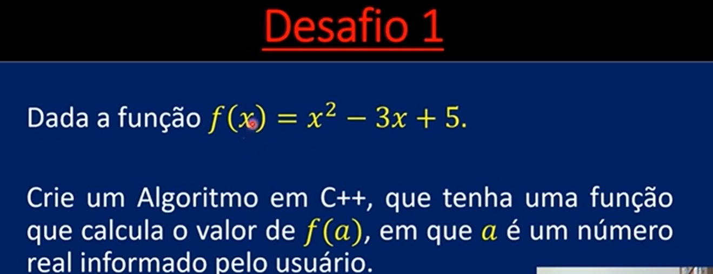

# 🧩 Função Quadrática

## 📌 Descrição
Calcula o valor da função f(x) = x² - 3x + 5 a partir de um valor informado pelo usuário.

## 🖼️ Enunciado

## 🧠 Conceitos
- Entrada de dados (cin)
- Operações matemáticas
- Variáveis

💡 Exercício clássico de matemática aplicado em programação.

## 📌 Autor

Pedro Henrique de Matos

## 📱 Contato

📸 [Instagram](https://instagram.com/pedroo_matoss)  
💼 [LinkedIn](https://linkedin.com/in/pedromatos-dev)