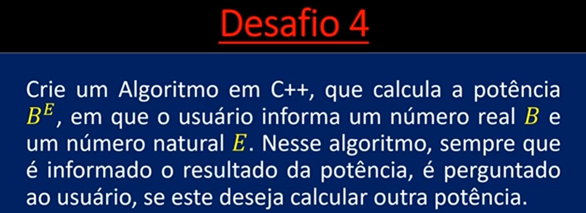

# 🧩 Cálculo de Potência

## 📌 Descrição
Calcula o valor de base elevado a um expoente positivo informado pelo usuário.

## 🖼️ Enunciado

## 🧠 Conceitos
- Funções
- Estruturas de repetição (while)
- Operações matemáticas

💡 O cálculo é feito manualmente, sem uso de funções prontas como pow().

## 📌 Autor

Pedro Henrique de Matos

## 📱 Contato

📸 [Instagram](https://instagram.com/pedroo_matoss)  
💼 [LinkedIn](https://linkedin.com/in/pedromatos-dev)